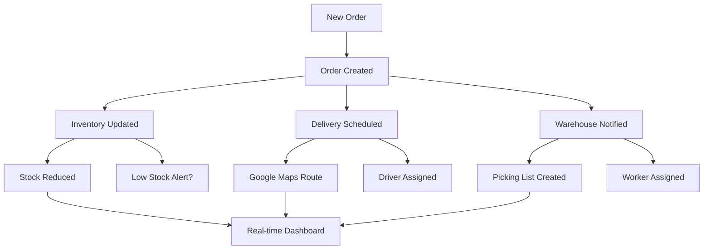

# 🛒 Walmart Logistics Dashboard

A fully automated logistics management system with real-time integration across all departments. Built with Python (Streamlit), Node.js, MongoDB, and Google Maps API.

## 🚀 Features

### ✨ Full Automation
- **One-Click Order Processing**: Place an order and watch all systems update automatically
- **Real-Time Integration**: Inventory, delivery, and warehouse systems sync instantly
- **Cross-Department Updates**: No manual coordination needed between teams

### 🗺️ Google Maps Integration
- **Real-Time Routing**: Traffic-aware delivery route optimization
- **Live Tracking**: GPS-based delivery tracking with ETAs
- **Address Geocoding**: Automatic address validation and coordinates
- **Route Optimization**: AI-powered multi-stop delivery planning

### 📊 Department Modules

#### 📦 Orders Management
- Automated order processing with real-time status updates
- Integration with inventory, delivery, and warehouse systems
- Order tracking with Google Maps integration
- Automatic status updates (pending → shipped → delivered)

#### 📚 Inventory Management
- Real-time stock level updates when orders are placed
- Automatic low-stock alerts and reorder notifications
- Stock tracking across multiple categories
- Integration with order fulfillment

#### 🚚 Delivery Tracking
- Google Maps powered routing and tracking
- Real-time driver location updates
- Traffic-aware ETA calculations
- Automatic delivery partner assignment
- Live route optimization

#### 🏪 Warehouse Operations
- Automatic picking list generation
- Worker assignment and task management
- Real-time status updates (picking → packing → dispatched)
- Location-based inventory management

#### 🔄 Integrated Dashboard
- Real-time metrics across all departments
- Live activity feed showing system updates
- Performance analytics and insights
- System health monitoring
- Add new orders form

### 📚 Inventory Tab
- Table of current inventory (SKU, qty, bin)
- Filters by SKU and low stock alerts
- Add new SKUs and update stock
- Category-wise stock pie chart

### 🚚 Delivery Tab
- Track delivery status
- Filter deliveries by date, agent, and region
- Live map tracking and route visualization
- Rescheduling for failed deliveries

### 🏢 Warehouse Tab
- Grid-style visualization of warehouse bins
- Route simulator with A* algorithm visualization
- Optimize slotting feature
- Heatmap of warehouse busy zones

### 🧠 Optimizer Tab
- Input delivery addresses manually or via file upload
- Route optimization with distance and ETA calculations
- Route visualization on map
- Clustering routes using DBSCAN algorithm

## 🛠️ Technology Stack

### Frontend
- **Streamlit**: Interactive web application framework
- **Python**: Core programming language
- **Pandas**: Data manipulation and analysis
- **Plotly**: Interactive charts and visualizations
- **Folium**: Map visualizations

### Backend
- **Node.js**: Server runtime
- **Express.js**: Web application framework
- **MongoDB**: NoSQL database
- **Mongoose**: MongoDB object modeling
- **Google Maps API**: Routing, geocoding, and places

### APIs & Integration
- **Google Maps API**: Route optimization and tracking
- **Google Places API**: Location services
- **MongoDB Atlas**: Cloud database
- **RESTful APIs**: Inter-service communication

## 🚀 Quick Start

### Prerequisites
- Node.js (v14 or higher)
- Python (v3.8 or higher)
- MongoDB Atlas account
- Google Maps API key

### 1. Clone the Repository
```bash
git clone https://github.com/YourUsername/walmart-logistics-dashboard.git
cd walmart-logistics-dashboard
```

### 2. Backend Setup
```bash
cd backend
npm install
```

Create a `.env` file in the backend directory:
```env
NODE_ENV=development
PORT=3000
FRONTEND_URL=http://localhost:8501

# MongoDB Configuration
MONGODB_URI=your-mongodb-connection-string
DB_NAME=walmart_logistics

# Google Maps API Keys
GOOGLE_MAPS_API_KEY=your-google-maps-api-key
GOOGLE_ROUTES_API_KEY=your-google-routes-api-key
GOOGLE_PLACES_API_KEY=your-google-places-api-key

# Security
JWT_SECRET=your-jwt-secret
ENCRYPTION_KEY=your-encryption-key
```

Start the backend server:
```bash
node server.js
```

### 3. Frontend Setup
```bash
cd ..
pip install -r requirements.txt
```

Start the frontend:
```bash
streamlit run app.py
```

### 4. Seed the Database (Optional)
```bash
cd backend
node seed.js
```

## 📱 Usage

1. **Access the Dashboard**: Open http://localhost:8501 in your browser
2. **Create an Order**: Go to Orders tab → Add New Order
3. **Watch the Magic**: See all systems update automatically:
   - Inventory stock reduces
   - Delivery gets scheduled with Google Maps route
   - Warehouse picking task created
   - Real-time updates across all tabs

## 🗺️ Google Maps Features

### Route Optimization
- Real-time traffic analysis
- Multi-stop route planning
- Dynamic ETA calculations
- Traffic-aware routing

### Live Tracking
- GPS-based location updates
- Real-time delivery status
- Interactive map visualization
- Customer notification system

### Geocoding & Places
- Address validation and formatting
- Coordinate conversion
- Nearby warehouse detection
- Place details and information

## 🔧 API Endpoints

### Core APIs
- `GET /api/orders` - Get all orders
- `POST /api/orders` - Create new order
- `GET /api/inventory` - Get inventory data
- `GET /api/delivery` - Get delivery information
- `GET /api/warehouse` - Get warehouse operations

### Integration APIs
- `POST /api/integration/order` - Create integrated order (updates all systems)
- `PATCH /api/integration/order/:id/status` - Update order with system sync

### Google Maps APIs
- `POST /api/delivery-tracking/calculate-route` - Calculate optimized route
- `GET /api/delivery-tracking/:id/live-tracking` - Get live tracking
- `POST /api/delivery-tracking/bulk-optimize` - Optimize multiple routes
- `GET /api/delivery-tracking/traffic-info` - Get traffic information

## 🔄 Integration Flow



## 📊 Key Metrics

The dashboard tracks:
- **Orders**: Total, today's count, pending orders, revenue
- **Inventory**: Total products, low stock alerts, out-of-stock items
- **Deliveries**: Pending, in-transit, delivered today
- **Warehouse**: Picking tasks, processing status, worker assignments

## 🎯 Demo

### Order Placement Flow
1. Customer places order → 📦 Order system records
2. Automatic inventory update → 📊 Stock levels decrease
3. Google Maps route calculation → 🗺️ Optimized delivery route
4. Delivery partner assignment → 🚚 Driver gets notification
5. Warehouse task creation → 🏪 Picking list generated
6. Real-time status updates → 📱 Live dashboard updates

### Live Integration Demo
Try the integration demo in the dashboard:
- Click "Create Demo Order" in any tab
- Watch real-time updates across all systems
- See Google Maps routing in action
- Monitor live tracking and ETAs

This system demonstrates the power of full automation in logistics management with modern web technologies and API integrations.

## 🤝 Contributing

1. Fork the repository
2. Create a feature branch: `git checkout -b feature/amazing-feature`
3. Commit your changes: `git commit -m 'Add amazing feature'`
4. Push to the branch: `git push origin feature/amazing-feature`
5. Open a Pull Request

## 📝 License

This project is licensed under the MIT License.

## 🙏 Acknowledgments

- Google Maps API for routing and geocoding services
- MongoDB Atlas for cloud database hosting
- Streamlit for the amazing frontend framework
- All the open-source libraries that made this possible

---

**Built with ❤️ for efficient logistics management**
