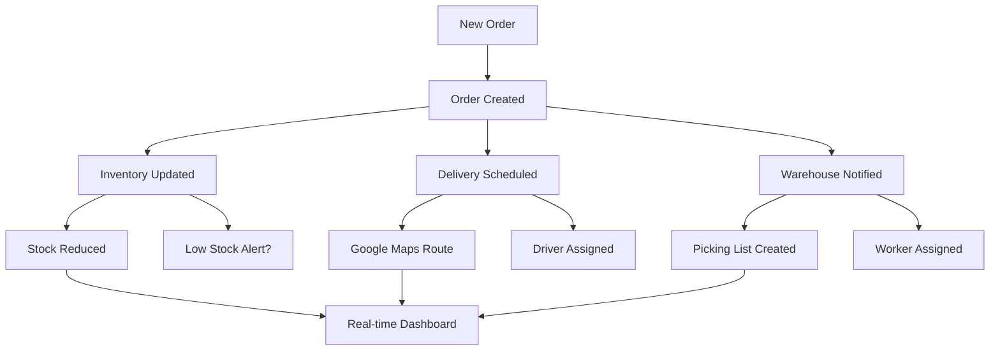

# 🛒 Walmart Logistics Dashboard

A fully automated logistics management system with real-time integration across all departments. Built with Python (Streamlit), Node.js, MongoDB, and Google Maps API.

## 🚀 Features

### ✨ Full Automation
- **One-Click Order Processing**: Place an order and watch all systems update automatically
- **Real-Time Integration**: Inventory, delivery, and warehouse systems sync instantly
- **Cross-Department Updates**: No manual coordination needed between teams

### 🗺️ Google Maps Integration
- **Real-Time Routing**: Traffic-aware delivery route optimization
- **Live Tracking**: GPS-based delivery tracking with ETAs
- **Address Geocoding**: Automatic address validation and coordinates
- **Route Optimization**: AI-powered multi-stop delivery planning

### 📊 Department Modules

#### 📦 Orders Management
- Automated order processing with real-time status updates
- Integration with inventory, delivery, and warehouse systems
- Order tracking with Google Maps integration
- Automatic status updates (pending → shipped → delivered)

#### 📚 Inventory Management
- Real-time stock level updates when orders are placed
- Automatic low-stock alerts and reorder notifications
- Stock tracking across multiple categories
- Integration with order fulfillment

#### 🚚 Delivery Tracking
- Google Maps powered routing and tracking
- Real-time driver location updates
- Traffic-aware ETA calculations
- Automatic delivery partner assignment
- Live route optimization

#### 🏪 Warehouse Operations
- Automatic picking list generation
- Worker assignment and task management
- Real-time status updates (picking → packing → dispatched)
- Location-based inventory management

#### 🔄 Integrated Dashboard
- Real-time metrics across all departments
- Live activity feed showing system updates
- Performance analytics and insights
- System health monitoring
- Add new orders form

### 📚 Inventory Tab
- Table of current inventory (SKU, qty, bin)
- Filters by SKU and low stock alerts
- Add new SKUs and update stock
- Category-wise stock pie chart

### 🚚 Delivery Tab
- Track delivery status
- Filter deliveries by date, agent, and region
- Live map tracking and route visualization
- Rescheduling for failed deliveries

### 🏢 Warehouse Tab
- Grid-style visualization of warehouse bins
- Route simulator with A* algorithm visualization
- Optimize slotting feature
- Heatmap of warehouse busy zones

### 🧠 Optimizer Tab
- Input delivery addresses manually or via file upload
- Route optimization with distance and ETA calculations
- Route visualization on map
- Clustering routes using DBSCAN algorithm

## 🛠️ Technology Stack

### Frontend
- **Streamlit**: Interactive web application framework
- **Python**: Core programming language
- **Pandas**: Data manipulation and analysis
- **Plotly**: Interactive charts and visualizations
- **Folium**: Map visualizations

### Backend
- **Node.js**: Server runtime
- **Express.js**: Web application framework
- **MongoDB**: NoSQL database
- **Mongoose**: MongoDB object modeling
- **Google Maps API**: Routing, geocoding, and places

### APIs & Integration
- **Google Maps API**: Route optimization and tracking
- **Google Places API**: Location services
- **MongoDB Atlas**: Cloud database
- **RESTful APIs**: Inter-service communication

## 🚀 Quick Start

### Prerequisites
- Node.js (v14 or higher)
- Python (v3.8 or higher)
- MongoDB Atlas account
- Google Maps API key

### 1. Clone the Repository
```bash
git clone https://github.com/YourUsername/walmart-logistics-dashboard.git
cd walmart-logistics-dashboard
```

### 2. Backend Setup
```bash
cd backend
npm install
```

Create a `.env` file in the backend directory:
```env
NODE_ENV=development
PORT=3000
FRONTEND_URL=http://localhost:8501

# MongoDB Configuration
MONGODB_URI=your-mongodb-connection-string
DB_NAME=walmart_logistics

# Google Maps API Keys
GOOGLE_MAPS_API_KEY=your-google-maps-api-key
GOOGLE_ROUTES_API_KEY=your-google-routes-api-key
GOOGLE_PLACES_API_KEY=your-google-places-api-key

# Security
JWT_SECRET=your-jwt-secret
ENCRYPTION_KEY=your-encryption-key
```

Start the backend server:
```bash
node server.js
```

### 3. Frontend Setup
```bash
cd ..
pip install -r requirements.txt
```

Start the frontend:
```bash
streamlit run app.py
```

### 4. Seed the Database (Optional)
```bash
cd backend
node seed.js
```

## 📱 Usage

1. **Access the Dashboard**: Open http://localhost:8501 in your browser
2. **Create an Order**: Go to Orders tab → Add New Order
3. **Watch the Magic**: See all systems update automatically:
   - Inventory stock reduces
   - Delivery gets scheduled with Google Maps route
   - Warehouse picking task created
   - Real-time updates across all tabs

## 🗺️ Google Maps Features

### Route Optimization
- Real-time traffic analysis
- Multi-stop route planning
- Dynamic ETA calculations
- Traffic-aware routing

### Live Tracking
- GPS-based location updates
- Real-time delivery status
- Interactive map visualization
- Customer notification system

### Geocoding & Places
- Address validation and formatting
- Coordinate conversion
- Nearby warehouse detection
- Place details and information

## 🔧 API Endpoints

### Core APIs
- `GET /api/orders` - Get all orders
- `POST /api/orders` - Create new order
- `GET /api/inventory` - Get inventory data
- `GET /api/delivery` - Get delivery information
- `GET /api/warehouse` - Get warehouse operations

### Integration APIs
- `POST /api/integration/order` - Create integrated order (updates all systems)
- `PATCH /api/integration/order/:id/status` - Update order with system sync

### Google Maps APIs
- `POST /api/delivery-tracking/calculate-route` - Calculate optimized route
- `GET /api/delivery-tracking/:id/live-tracking` - Get live tracking
- `POST /api/delivery-tracking/bulk-optimize` - Optimize multiple routes
- `GET /api/delivery-tracking/traffic-info` - Get traffic information

## 🔄 Integration Flow



## 📊 Key Metrics

The dashboard tracks:
- **Orders**: Total, today's count, pending orders, revenue
- **Inventory**: Total products, low stock alerts, out-of-stock items
- **Deliveries**: Pending, in-transit, delivered today
- **Warehouse**: Picking tasks, processing status, worker assignments

## 🎯 Demo

### Order Placement Flow
1. Customer places order → 📦 Order system records
2. Automatic inventory update → 📊 Stock levels decrease
3. Google Maps route calculation → 🗺️ Optimized delivery route
4. Delivery partner assignment → 🚚 Driver gets notification
5. Warehouse task creation → 🏪 Picking list generated
6. Real-time status updates → 📱 Live dashboard updates

### Live Integration Demo
Try the integration demo in the dashboard:
- Click "Create Demo Order" in any tab
- Watch real-time updates across all systems
- See Google Maps routing in action
- Monitor live tracking and ETAs

This system demonstrates the power of full automation in logistics management with modern web technologies and API integrations.

## 🤝 Contributing

1. Fork the repository
2. Create a feature branch: `git checkout -b feature/amazing-feature`
3. Commit your changes: `git commit -m 'Add amazing feature'`
4. Push to the branch: `git push origin feature/amazing-feature`
5. Open a Pull Request

## 📝 License

This project is licensed under the MIT License.

## 🙏 Acknowledgments

- Google Maps API for routing and geocoding services
- MongoDB Atlas for cloud database hosting
- Streamlit for the amazing frontend framework
- All the open-source libraries that made this possible

---

**Built with ❤️ for efficient logistics management**

## 🎨 Frontend Architecture (Streamlit)

### Main Application (`app.py`)
The main Streamlit application serves as the entry point and navigation hub:

```python
import streamlit as st
import os
from PIL import Image
from streamlit_option_menu import option_menu
from tabs import TABS
from utils.helpers import show_notification

# Multi-page navigation with custom styling
# Logo and branding integration
# Session state management for cross-tab communication
# Custom CSS for Walmart branding
```

**Key Features:**
- 🧭 **Navigation**: Option menu with icons for each department
- 🎨 **Styling**: Custom CSS with Walmart blue theme
- 📱 **Responsive**: Adapts to different screen sizes
- 🔄 **State Management**: Persistent data across tabs

### 📦 Orders Tab (`tabs/orders.py`)

**Core Functionality:**
- **Order Creation**: Full order form with validation
- **Integration Display**: Shows real-time updates across all systems
- **Status Management**: Order lifecycle tracking
- **Google Maps Integration**: Delivery route visualization

```python
def create_integrated_order(order_data):
    """Creates order with automatic system integration"""
    # Validates order data
    # Calls backend integration endpoint
    # Displays real-time integration results
    # Shows Google Maps routing information
```

**Key Components:**
- 📊 **KPI Metrics**: Today's orders, pending deliveries
- 🔍 **Filters**: Date range, status, search functionality
- ➕ **Order Form**: Customer info, product details, delivery address
- 🔄 **Integration Status**: Real-time updates from all departments
- 🗺️ **Maps Integration**: Google Maps links for delivery tracking

### 📚 Inventory Tab (`tabs/inventory.py`)

**Core Functionality:**
- **Stock Management**: Real-time inventory levels  
- **Category Organization**: Product categorization and filtering
- **Low Stock Alerts**: Automatic reorder notifications
- **Supplier Management**: Vendor information and contacts

```python
def update_inventory_for_order():
    """Automatically reduces stock when orders are placed"""
    # Finds product in inventory
    # Reduces stock quantity
    # Triggers low stock alerts
    # Updates reorder recommendations
```

**Key Components:**
- 📊 **Analytics**: Stock value, turnover rates, category distribution
- 🔍 **Search & Filter**: SKU, category, stock status filtering
- ➕ **Add Products**: New product creation with validation
- ⚠️ **Alerts**: Low stock warnings and reorder suggestions
- 📈 **Charts**: Stock distribution and category analysis

### 🚚 Delivery Tab (`tabs/delivery.py`)

**Google Maps Integration:**
- **Real-Time Routing**: Traffic-aware route calculation
- **Live Tracking**: GPS-based driver location updates
- **Route Optimization**: Multi-stop delivery planning
- **ETA Calculations**: Dynamic arrival time estimates

```python
def get_delivery_live_tracking(delivery_id):
    """Gets real-time tracking with Google Maps"""
    # Calls Google Maps API for current location
    # Calculates remaining distance and time
    # Updates traffic conditions
    # Generates tracking links
```

**Advanced Features:**
- 🗺️ **Interactive Maps**: Folium integration with live updates
- 🚦 **Traffic Analysis**: Real-time traffic condition monitoring
- 🛣️ **Route Optimization**: AI-powered delivery sequencing
- 📍 **Geocoding**: Address validation and coordinate conversion
- 📱 **Mobile Links**: Direct Google Maps navigation links

### 🏪 Warehouse Tab (`tabs/warehouse.py`)

**Warehouse Operations:**
- **Pick List Management**: Automated picking task generation
- **Worker Assignment**: Dynamic staff allocation
- **Location Optimization**: Bin location and slotting optimization
- **Capacity Management**: Space utilization tracking

```python
def update_warehouse_for_order():
    """Creates warehouse tasks when orders are placed"""
    # Generates picking lists
    # Assigns available workers
    # Optimizes pick routes
    # Updates inventory locations
```

**Visual Features:**
- 🏗️ **3D Warehouse View**: Interactive warehouse layout
- 🗺️ **Heatmaps**: Activity and utilization visualization
- 📊 **Capacity Charts**: Space and resource utilization
- 🔄 **Task Flow**: Pick → Pack → Ship workflow visualization

### 🧠 Optimizer Tab (`tabs/optimizer.py`)

**Optimization Algorithms:**
- **Route Planning**: TSP and VRP algorithm implementations
- **Inventory Optimization**: Safety stock and reorder point calculation
- **Resource Allocation**: Staff and equipment optimization
- **Demand Forecasting**: Predictive analytics for inventory planning

```python
def optimize_delivery_routes():
    """Uses Google Maps to optimize multi-stop routes"""
    # Calls Google Maps Directions API
    # Implements route optimization algorithms
    # Considers traffic patterns and constraints
    # Returns optimized sequence and timing
```

**AI-Powered Features:**
- 🤖 **Machine Learning**: Demand prediction models
- 📈 **Analytics**: Performance trend analysis
- 🎯 **Recommendations**: Data-driven optimization suggestions
- 📊 **Visualization**: Interactive charts and maps

### 🔄 Integrated Dashboard (`tabs/integrated_dashboard.py`)

**Real-Time Integration:**
- **Live Metrics**: Cross-system KPI monitoring
- **Activity Feed**: Real-time system update notifications
- **System Health**: API connectivity and performance monitoring
- **Integration Testing**: End-to-end system validation

```python
def get_integrated_dashboard_data():
    """Aggregates data from all systems"""
    # Calls all backend APIs
    # Calculates integrated metrics
    # Provides real-time status updates
    # Monitors system health
```

**Dashboard Components:**
- 📊 **KPI Grid**: Key metrics from all departments
- 📱 **Activity Stream**: Live system updates and notifications
- 🔧 **System Status**: Health monitoring and diagnostics
- 🎯 **Quick Actions**: One-click operations across systems

## 🔧 Utility Modules

### API Client (`utils/api.py`)

**Core API Integration:**
```python
class WalmartAPI:
    """Comprehensive API client for backend communication"""
    
    def __init__(self, base_url="http://localhost:3000"):
        # HTTP session management
        # Error handling and retries
        # Request/response formatting
    
    def create_integrated_order(self, order_data):
        # Calls integration endpoint
        # Handles cross-system updates
        # Returns detailed status information
```

**Google Maps Functions:**
```python
def get_delivery_live_tracking(delivery_id):
    """Real-time delivery tracking with Google Maps"""

def calculate_delivery_route(origin, destination):
    """Route calculation with traffic awareness"""

def optimize_delivery_routes(deliveries):
    """Multi-stop route optimization"""

def geocode_address(address):
    """Address geocoding and validation"""
```

### Helper Functions (`utils/helpers.py`)

**UI Components:**
```python
def display_kpi_metrics(data):
    """Renders KPI metric cards with styling"""

def show_notification(message, type="info"):
    """Displays styled notifications"""

def format_date(date_string):
    """Consistent date formatting across the app"""

def create_interactive_map(locations):
    """Generates Folium maps with markers and routes"""
```

## 🎨 Custom Styling & Branding

### CSS Customization
```css
.main-header {
    font-size: 2.5rem !important;
    font-weight: 600;
    color: #0071ce; /* Walmart Blue */
}

.stButton>button {
    background-color: #0071ce;
    color: white;
    border-radius: 5px;
}

.stMetric {
    background-color: #f8f9fa;
    padding: 10px;
    border-radius: 5px;
    box-shadow: 0 2px 5px rgba(0,0,0,0.1);
}
```

### Visual Components
- 🎨 **Color Scheme**: Walmart blue (#0071ce) with professional grays
- 📱 **Icons**: Font Awesome integration for intuitive navigation
- 📊 **Charts**: Plotly with custom Walmart-themed color schemes
- 🗺️ **Maps**: Folium integration with custom markers and styling

## 📱 User Experience Features

### Navigation & Flow
- **Tabbed Interface**: Easy switching between departments
- **Breadcrumb Navigation**: Clear user location awareness
- **Quick Actions**: One-click common operations
- **Search & Filter**: Fast data discovery across all modules

### Real-Time Updates
- **Live Data Refresh**: Automatic data synchronization
- **Status Notifications**: Instant feedback on user actions
- **Progress Indicators**: Clear feedback for long-running operations
- **Error Handling**: User-friendly error messages and recovery

### Mobile Responsiveness
- **Adaptive Layout**: Works on desktop, tablet, and mobile
- **Touch-Friendly**: Optimized for touch interactions
- **Responsive Charts**: Automatically resize for screen size
- **Mobile Maps**: Native Google Maps integration on mobile devices

## 🔧 Configuration & Setup

### Environment Configuration
```python
# Frontend configuration in app.py
BACKEND_URL = "http://localhost:3000"
DEBUG_MODE = True
AUTO_REFRESH_INTERVAL = 30  # seconds
```

### Session State Management
```python
# Cross-tab state management
if 'selected_tab' not in st.session_state:
    st.session_state.selected_tab = "📦 Orders"

if 'show_add_order_form' not in st.session_state:
    st.session_state.show_add_order_form = False
```

### Performance Optimization
- **Caching**: `@st.cache_data` for expensive operations
- **Lazy Loading**: Components load only when needed
- **Efficient Rendering**: Minimal re-renders on state changes
- **API Optimization**: Batched requests where possible

## 🖥️ Backend Architecture (Node.js)

### Main Server (`server.js`)
Express.js application with comprehensive middleware stack:

```javascript
const app = express();

// Security & Performance Middleware
app.use(helmet());              // Security headers
app.use(compression());         // Response compression
app.use(rateLimit());          // Rate limiting
app.use(cors());               // Cross-origin support
app.use(morgan('combined'));   // Request logging

// API Routes
app.use('/api/orders', ordersRoutes);
app.use('/api/inventory', inventoryRoutes);
app.use('/api/delivery', deliveryRoutes);
app.use('/api/delivery-tracking', deliveryTrackingRoutes);
app.use('/api/warehouse', warehouseRoutes);
app.use('/api/integration', integrationRoutes);
```

### 🔄 Integration System (`routes/integration.js`)

**Automated Order Processing:**
```javascript
router.post('/order', async (req, res) => {
    // 1. Create order record
    const order = await databaseService.createOrder(orderData);
    
    // 2. Update inventory automatically
    const inventoryUpdate = await updateInventoryForOrder(order);
    
    // 3. Create delivery with Google Maps routing
    const deliveryRecord = await createDeliveryForOrder(order);
    
    // 4. Update warehouse operations
    const warehouseUpdate = await updateWarehouseForOrder(order);
    
    // Return comprehensive integration status
});
```

**Cross-System Status Updates:**
```javascript
router.patch('/order/:id/status', async (req, res) => {
    // Updates order status and triggers related system updates
    // Handles: shipped → delivery updates, cancelled → inventory restore
});
```

### 🗺️ Google Maps Service (`services/googleMapsService.js`)

**Route Calculation & Optimization:**
```javascript
class GoogleMapsService {
    async calculateRoute(origin, destination, optimizeWaypoints = true) {
        // Uses Google Routes API for advanced routing
        // Considers real-time traffic conditions
        // Returns distance, duration, and polyline data
    }
    
    async optimizeDeliveryRoute(origin, destinations) {
        // Multi-stop route optimization
        // Waypoint ordering for efficiency
        // Traffic-aware calculations
    }
    
    async getDeliveryTracking(deliveryId, currentLocation, destination) {
        // Real-time tracking calculations
        // Updated ETAs based on current location
        // Traffic condition monitoring
    }
}
```

**Address & Location Services:**
```javascript
async geocodeAddress(address) {
    // Convert addresses to coordinates
    // Validate delivery addresses
    // Return formatted address data
}

async findNearbyWarehouses(location, radius = 5000) {
    // Google Places API integration
    // Find distribution centers and warehouses
    // Distance calculations
}
```

### 🚚 Delivery Tracking (`routes/deliveryTracking.js`)

**Real-Time Tracking Endpoints:**
```javascript
// Live tracking with GPS updates
router.get('/:id/live-tracking', async (req, res) => {
    // Get current driver location
    // Calculate remaining route with traffic
    // Return real-time tracking data
});

// Route calculation and optimization
router.post('/calculate-route', async (req, res) => {
    // Google Maps route calculation
    // Traffic-aware routing
    // Generate maps links
});

// Bulk route optimization for multiple deliveries
router.post('/bulk-optimize', async (req, res) => {
    // Optimize multiple delivery routes
    // Consider vehicle capacity and time windows
    // Return optimized sequence
});
```

### 📊 Database Service (`services/databaseService.js`)

**MongoDB Integration:**
```javascript
class DatabaseService {
    async createOrder(orderData) {
        // Validate order data
        // Generate unique order ID
        // Store in MongoDB with timestamps
    }
    
    async updateInventory(productId, stockChange) {
        // Atomic stock updates
        // Prevent negative inventory
        // Log inventory transactions
    }
    
    async createDelivery(deliveryData) {
        // Link to order records
        // Store route and tracking information
        // Initialize delivery status
    }
    
    async createWarehouse(warehouseData) {
        // Store picking and packing tasks
        // Link to orders and inventory
        // Track worker assignments
    }
}
```

**MongoDB Models:**
```javascript
// Product/Inventory Schema
const productSchema = {
    sku: String,
    name: String,
    category: String,
    stock_quantity: Number,
    min_stock_level: Number,
    cost: Number,
    supplier: String,
    location: String
};

// Delivery Schema with Google Maps integration
const deliverySchema = {
    delivery_id: String,
    order_id: String,
    driver_name: String,
    delivery_address: String,
    delivery_coordinates: { lat: Number, lng: Number },
    route_info: {
        distance: Object,
        duration: Object,
        google_maps_link: String,
        traffic_aware: Boolean
    },
    google_integration: {
        geocoded: Boolean,
        route_calculated: Boolean,
        api_version: String
    }
};
```

### 📦 Order Management (`routes/orders.js`)

**CRUD Operations:**
```javascript
// Get orders with filtering and pagination
router.get('/', async (req, res) => {
    // Support filtering by status, date, customer
    // Pagination for large datasets
    // Search functionality
});

// Create new order
router.post('/', async (req, res) => {
    // Validate order data
    // Generate unique identifiers
    // Initialize order status
});

// Update order status with integration
router.patch('/:id/status', async (req, res) => {
    // Update order status
    // Trigger related system updates
    // Return integration results
});
```

### 📚 Inventory Management (`routes/inventory.js`)

**Stock Management:**
```javascript
// Get inventory with advanced filtering
router.get('/', async (req, res) => {
    // Filter by category, stock status, supplier
    // Search by SKU or product name
    // Include calculated metrics (value, turnover)
});

// Update stock levels
router.patch('/:id/stock', async (req, res) => {
    // Atomic stock updates
    // Prevent negative inventory
    // Log stock transactions
    // Trigger reorder alerts
});

// Low stock alerts
router.get('/low-stock', async (req, res) => {
    // Identify products below reorder point
    // Calculate recommended reorder quantities
    // Include supplier information
});
```

### 🏪 Warehouse Operations (`routes/warehouse.js`)

**Warehouse Management:**
```javascript
// Get warehouse status and utilization
router.get('/', async (req, res) => {
    // Current capacity and utilization
    // Active picking/packing tasks
    // Worker assignments and productivity
});

// Update warehouse utilization
router.patch('/:id/utilization', async (req, res) => {
    // Real-time capacity updates
    // Zone utilization tracking
    // Efficiency metrics
});

// Zone management
router.post('/:id/zones', async (req, res) => {
    // Add new warehouse zones
    // Configure zone capacities
    // Assign product categories to zones
});
```

### 🧠 Optimization Engine (`routes/optimizer.js`)

**AI-Powered Optimization:**
```javascript
// Route optimization with Google Maps
router.get('/route', async (req, res) => {
    // Multi-vehicle routing problem (VRP)
    // Consider vehicle capacity and time windows
    // Real-time traffic integration
});

// Inventory optimization
router.post('/inventory', async (req, res) => {
    // Calculate optimal stock levels
    // Safety stock recommendations
    // Reorder point optimization
    // ABC analysis for inventory prioritization
});

// Demand forecasting
router.post('/demand-forecast', async (req, res) => {
    // Historical sales analysis
    // Seasonal trend identification
    // Machine learning predictions
    // Forecast accuracy metrics
});
```

### 📊 Dashboard Data (`routes/dashboard.js`)

**Real-Time Analytics:**
```javascript
// Comprehensive dashboard overview
router.get('/overview', async (req, res) => {
    // Aggregate data from all systems
    // Calculate KPIs and metrics
    // Real-time status updates
    // Performance indicators
});

// Detailed analytics for charts
router.get('/analytics', async (req, res) => {
    // Time-series data for trends
    // Comparative analysis
    // Drill-down capabilities
    // Export functionality
});
```

## 🔐 Security & Performance

### Security Features
```javascript
// Security middleware stack
app.use(helmet({
    contentSecurityPolicy: {
        directives: {
            defaultSrc: ["'self'"],
            scriptSrc: ["'self'", "'unsafe-inline'", "maps.googleapis.com"],
            styleSrc: ["'self'", "'unsafe-inline'"],
            imgSrc: ["'self'", "data:", "maps.googleapis.com", "*.googleapis.com"]
        }
    }
));

// Rate limiting
const limiter = rateLimit({
    windowMs: 15 * 60 * 1000, // 15 minutes
    max: 100 // limit each IP to 100 requests per windowMs
});
```

### Performance Optimization
```javascript
// Response compression
app.use(compression());

// Efficient database queries
const aggregationPipeline = [
    { $match: { status: 'active' } },
    { $group: { _id: '$category', total: { $sum: '$quantity' } } },
    { $sort: { total: -1 } }
];

// Caching strategies
const cache = new Map();
const getCachedData = (key, fetchFunction, ttl = 300000) => {
    // 5-minute cache for expensive operations
};
```

### Error Handling & Logging
```javascript
// Global error handler
app.use((err, req, res, next) => {
    console.error('Error:', err);
    res.status(err.status || 500).json({
        error: err.message || 'Internal Server Error',
        ...(process.env.NODE_ENV === 'development' && { stack: err.stack })
    });
});

// Request logging
app.use(morgan('combined', {
    stream: fs.createWriteStream(path.join(__dirname, 'access.log'), { flags: 'a' })
}));
```

## 🌐 API Documentation

### Response Format
All API endpoints return consistent JSON responses:
```javascript
{
    "success": true|false,
    "data": { /* response data */ },
    "message": "Success message",
    "error": "Error message (if any)",
    "integration_status": { /* cross-system update status */ },
    "timestamp": "2025-06-30T10:30:00.000Z"
}
```

### Integration Endpoints
```
POST /api/integration/order
- Creates order with automatic cross-system updates
- Returns: order data + integration status + detailed updates

PATCH /api/integration/order/:id/status  
- Updates order status with related system updates
- Returns: updated order + integration results

GET /api/integration/delivery/:id/tracking
- Real-time delivery tracking with Google Maps
- Returns: live tracking data + route information

POST /api/integration/optimize-routes
- Multi-delivery route optimization
- Returns: optimized routes + time/distance savings
```

### Google Maps Integration Endpoints
```
POST /api/delivery-tracking/calculate-route
- Calculate route between two points
- Returns: distance, duration, traffic conditions, maps link

GET /api/delivery-tracking/:id/live-tracking
- Real-time delivery tracking
- Returns: current location, ETA, remaining distance

POST /api/delivery-tracking/bulk-optimize
- Optimize routes for multiple deliveries
- Returns: optimized sequence + total savings

PUT /api/delivery-tracking/:id/update-location
- Update driver location for tracking
- Returns: updated ETA + route information
```
